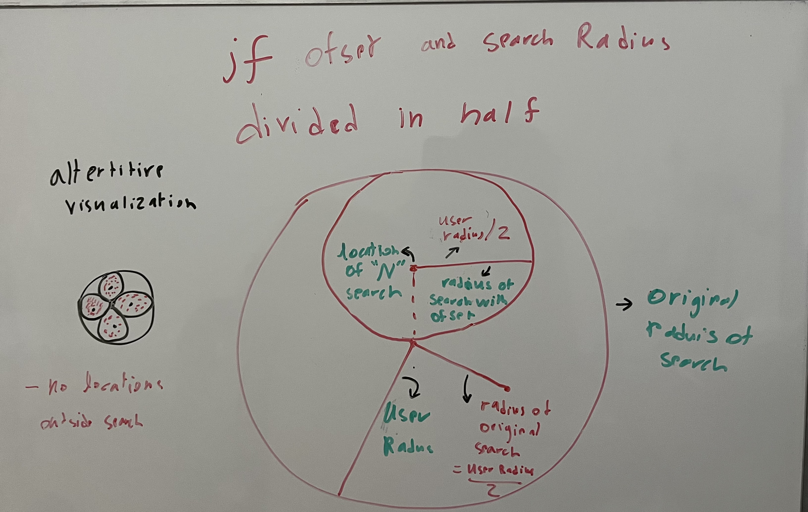
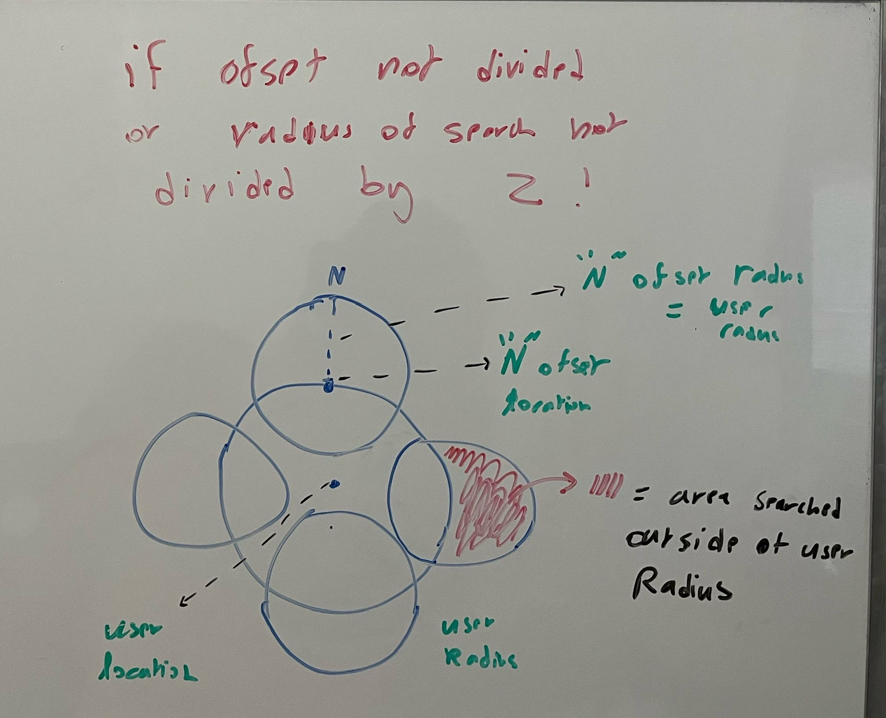
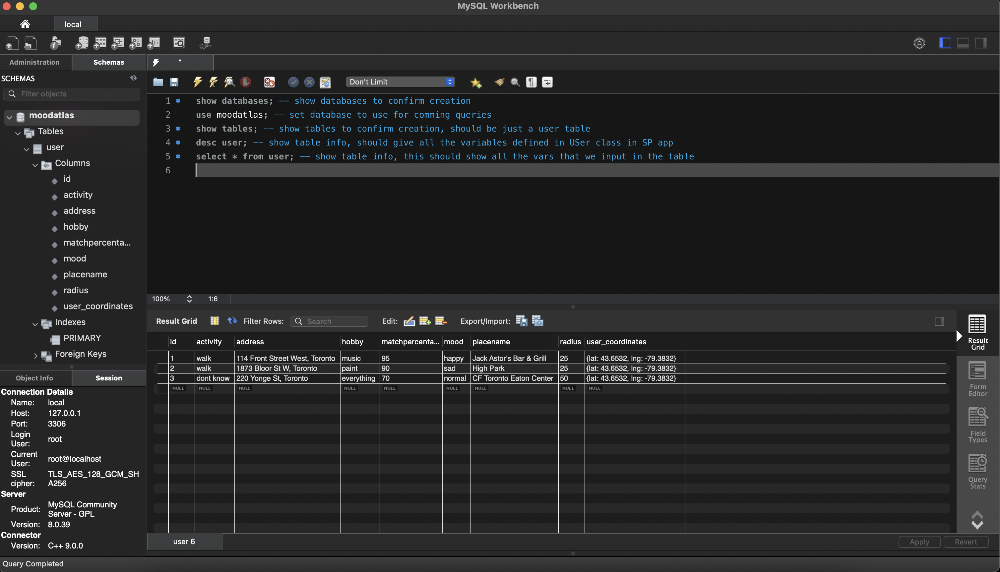
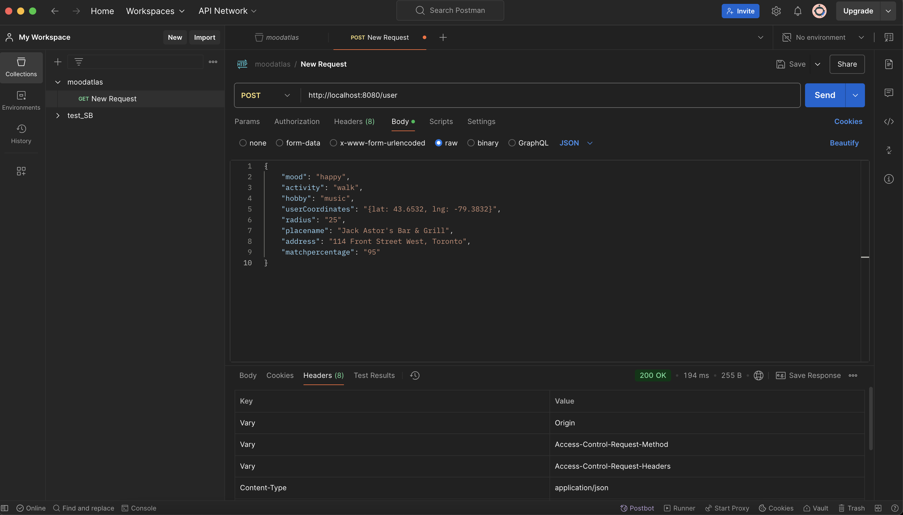

<h1 style="border-bottom: none; margin: 0; color:orange">Mood Atlas</h1>

*"Chart your feelings, discover your destination"*

---
### The Production Build For This App Is a Little Different, <a href="https://github.com/HaiderMalikk/mood-atlas-production_build" style="color: blue;">Check That Out Here</a>.

---

## Project Summary: **Mood Atlas**

**Mood Atlas** is an innovative app that recommends destinations based on user moods, places, or feelings. The project integrates multiple technologies for seamless functionality. The combination of AI and real-time data creates a personalized experience, guiding users to destinations that match their feelings. This app is expected to be released in the near future. **See the bottom of this file for the latest updates**.

- **Frontend**:  
  - Developed with **React** and **Next.js**.  
  - Uses **Google Maps API** to display locations on a map.  
  - Fetches images and reviews via the **Google Places API** and displays them in user-friendly cards with info on the place.

- **Python AI Backend**:  
  - Processes user prompts and location data.  
  - Uses **Flask** for API endpoints. So that the nextjs and python backend can communicate with each other.
  - Leverages **ChatGPT’s LLM** to generate personalized place recommendations.    

- **Spring Boot Backend**:  
  - Manages user data (e.g., mood, location, placeRecomended) via **SQL** and **Postman**.  

## **Technologies Used in Mood Atlas**

- **React**: A JavaScript library for building user interfaces, primarily for creating dynamic and responsive front-end web applications.
- **Next.js**: A React-based framework that enables server-side rendering, static site generation, and other advanced web development features.
- **Google Maps API**: Provides interactive maps and location data, allowing the app to display user destinations on a map.
- **Google Places API**: Fetches information about places, such as names, addresses, reviews, and images, to enhance user experience by providing more details about recommended locations.
- **Other API's**: Uses ipapi to get the users initial location, uses heroku to allow user to get places near them eithout using a external api file or dealing with CORS issues.
- **Flask**: A python web framework that allows for the creation of backend APIs, used for processing user prompts and location data.
- **ChatGPT’s LLM (Large Language Model)**: A powerful AI language model by OpenAI used to process and generate human-like responses to user input, providing personalized recommendations.
- **Spring Boot**: A Java-based framework used to build the back-end API, manage user data.
- **SQL**: used to manage and manipulate user data from the Sprig App.
- **Postman**: A tool for testing and interacting with APIs, ensuring the functionality of the Spring Boot backend through the creation and execution of requests.


## Project Structure
-**Not including the default Next.js files/ untouched files**
```
MOOD-ATLAS/
│
├── .next/                        # Next.js build and runtime files (this folder is the final build)
├── app/                          # main application code with all the individual files
│   ├── global.css                # contains all the css styles used throughout the app
│   ├── flask_llm_call.js         # this is where the flask backend is called and also where the data sent back is received from flask, this is called and returns its result tot processor 
│   ├── layout.js                 # defines the layout of the app i.e the header main page etc
│   ├── location_card.js          # contains the logic for displaying location cards with images etc on the map
│   ├── map.js                    # contains the main google map component 
│   ├── page.js                   # the main page of the app with all the formatting and order of components i.e where the map, location etc are and there logic along with the user inputs 
│   ├── places_fetch              # contains the logic for fetching places from google places api to give to the processor for it to forward it to flask
│   ├── places_processing.js      # this is where all the inputs are received and where we get the places send it to flask get its response and returns the result to the page
│   ├── post_users.js             # contains the logic for posting user data to the spring boot backend
│   └── user_location.js          # This is where we get the user's initial location from ipapi api.
├── assets/                       # contains all the static assets like images etc
├── flask-placefinder-backend/    # contains the python backend code for processing user input and generating recommendations
│   ├── jupyter_tests/            # contains the jupyter notebooks for testing the python backend along with some test data
│   └── server.py                 # the main flask server file where we get the data from the app files and then the llm is prompted to return a result back to the user
├── spring-backend/               # contains the spring boot backend code for the user data
│   ├── src/                      # root directory of the spring boot project
│   │   └── main/                 # contains the main application class contains the User class that defines the data so be posted, controllers for api requests, user repo, actual runnable class for the springboot init, application props and more
│   └── pom.xml                   # pom file containing all the imports for the springboot project                
├── utils/                        # contains utility functions used throughout the app like global colors etc
├── next.config.mjs               # contains the configuration for the next.js app like trusted domains etc
└── tailwind.config.mjs           # contains the configuration for tailwind css
```

## How the Website Works

- the user inputs the required stuff and then clicks submit, initially there location is shown on the map.
- this submitted data is propagated to the places fetch here we first fetch the nearby places by using google maps api and then we use this location data along with the user inputs to the flask backend. We process the data and generate recommendations for the user and return it.
- this recommendations places object contain info about the places that can be parsed and extracted for things like location, address etc.
- once all this is done we first send this user prompt data to the springboot backend to be stored in a sql database. Then we display the location to the user with the map and location card.
- below are some ex snippets of code detailing important parts of the process (NOT COMPLETE CODE JUST PARTS OF IT WITH PSEUDOCODE)

---

**Ex Data, Google Places API's nearby search returns us a json file that looks something like this, this data is needed for the website to work**

```json
{
  "name": "Residence Inn Toronto",
  {
  "place_id" : "ChIJRQoITNc0K4gRMBoATwPJLYs",
        "plus_code" : 
  },
  "vicinity" : "255 Wellington Street West, Toronto",
  "location" : 
  {
    "lat" : 43.64192569999999,
    "lng" : -79.3894923
  },
  "photos" : 
  [
    {
      "photo_reference" : "AWYs27znPtKuOjv43tZBTCFngJGTvlpvSD74iz3mXFo7trkgn8-jNhGtxP0zT8OdBpgRDLX4vih2Jvs-8PcJh_KVRfKablKQgHorz3rTNh0cqulc5R5OHjdI7JM2EwzxoCm_LSn2uKNu3Fw6MuYoFgSb-GrVlDZ2uudhal7pbx1KO3m7chFA",
    }
  ],
  {"etc etc this is not the exact format of the json file but it is something like this"}
}
```

---

**EX LLM prompt, here is an example of what the prompt might look like to ask the llm to pick a place**
```python
# init backend
app = Flask(__name__)
@app.route('/api/home', methods=['POST', 'GET'])
# invoke llm
llm = chatopenai(model, key, etc)
my_prompt = " FOLLOW THESE INSTRUCTION WITH DATA {places},{mood},{etc}  " # fill in with actual data from fontend
response = llm.prompt(my_prompt)
place_key = response[0]
response_data = {
  'place number from llm': place_key, 
}
return response_data
```

---

**EX Spring boot class for the defined user data**

```java
// defined user data class from the front end the same data is sent to this class
public class User {
    @Id
    @GeneratedValue
    long id;
    String mood;
    String activity;
    String hobby;
    String userCoordinates;
    int radius;
    String placename;
    String address;
    int matchpercentage;
}

// controls the data injection
public class usercontroller {
  @Autowired
  private UserRepo userRepo;
  User newUser(@RequestBody User newUser){
      return userRepo.save(newUser); 
  } 
}

// runs the Spring app
public class Application{
  public static void main(String[] args) {
      SpringApplication.run(DemoApplication.class, args);
  }
}
```

<h2 style="border-bottom: none; margin: 0;">RADIAL OFFSET ENGINE</h1>

*Radial Offset Engine for Google Maps Places API*

*Latitude vs Longitude:*


---

## Overview
The Google Maps API's **nearby search** feature retrieves locations near the user, split into **20 places per page**. If we were to fetch places at a single location and rely on pagination, it would take a long time to reach locations near the edge of the user's radius. This is because we would need to go through multiple pages to cover the entire area, which is inefficient.

To overcome this limitation, I developed the **Radial Offset Engine**. This engine efficiently retrieves places distributed across the user's search radius by offsetting search locations in the **North (N)**, **South (S)**, **East (E)**, and **West (W)** directions. Instead of only searching at the user's exact location, we perform multiple searches at nearby offset points.

Each search retrieves `n` pages of results, with **20 places per page**, ensuring that locations across the entire search radius are covered effectively.

### Key Adjustments To The Offset And Search Radius:
- The offset distance is **half the user's search radius** (`radius / 2`), preventing searches from going outside the user's desired area.
- The search radius at each offset location is also **halved** (`radius / 2`), ensuring places near the edges are not missed.
- ### i could go on and on about why i made these adjustments but here is a diagram that explains it:
- If we divide the search radius and offset distance by 2:



- If we DONT divide the search radius and offset distance by 2:


This engine performs **$(\text{X} \cdot \text{N})$** searches, where:
- **N** is the number of offset locations. In this case, **N = 4** (N, S, E, W).
- **X** is the number of places retrieved at each location.
- Since each page contains 20 places, we define:
  - **$\text{X} = \text{20} \cdot \text{n}$**, where **n** is the number of pages searched per location.

After gathering all places:
1. **Recursively fetch next pages** for each location until the page limit is reached.
2. **Remove duplicate places** to avoid redundant results in cases where two offsets overlap.

---

## Offset Calculation

### 1. **Latitude Offset (Base Offset)**
   - Latitude changes uniformly everywhere on Earth.
   - Offset in degrees: $1^\circ \approx 111.32 \text{ km}$
   - **Formula for base latitude offset:**
      - $\text{latOffset} = \frac{\text{radius}}{2 \times 111.32}$
   - **Example:** For a search radius of **25 km**:
     - $\text{latOffset} = \frac{25}{2 \times 111.32} \approx 0.112^\circ$
   - This offset is added or subtracted from the user’s latitude to move **North or South**.

### 2. **Longitude Offset**
   - Longitude offsets depend on latitude because the Earth's radius decreases as you move toward the poles.
   - Formula for longitude scaling:
     - $\text{lngScale} = \cos\left(\frac{\text{lat} \cdot \pi}{180}\right)$, Where the $\text{lat}$ is multiplied by $\left(\frac{\pi}{180}\right)$ to convert it to radiants
   - Adjusted longitude offset:
   - Adjusted longitude offset:
     - $\text{lngOffset} = \text{latOffset} \cdot \text{lngScale}$
   - **Example:**
     - At the equator \( \text{lat} = 0^\circ \), \( \text{lngScale} = 1 \), so:
       - $\text{lngOffset} = \text{latOffset}$
     - At 43.6532° (Toronto):
       - $\text{lngScale} = \cos\left(\frac{43.6532 \times \pi}{180}\right) \approx 0.722$
       - $\text{lngOffset} = 0.112 \times 0.722 \approx 0.081^\circ$

### 3. **Recursive Fetching**
   - At each location, retrieve all **n** pages of places (20 per page) before moving to the next offset.

---

## Directions of Search
- **N/S:** Add or subtract `latOffset` to/from latitude.
- **E/W:** Add or subtract `lngOffset` to/from longitude.

---

## Example: Coordinate Offsets

### Given:
- **User coordinates:**  
  - Lat: `43.6532`, Lng: `-79.3832`  
- **Radius:** `25 km`

### Step 1: Calculate Latitude Offset  
- $\text{latOffset} = \frac{\text{radius}}{2 \times 111.32} = \frac{25}{2 \times 111.32} \approx 0.112^\circ$

### Step 2: Calculate Longitude Offset  
- $\text{lngScale} = \cos\left(\frac{43.6532 \times \pi}{180}\right) \approx 0.722$
- $\text{lngOffset} = 0.112 \times 0.722 \approx 0.081^\circ$

### Step 3: North Move (Increase Latitude)  
New Coordinates:  
- Lat: \( 43.6532 + 0.112 = 43.7652 \)  
- Lng: `-79.3832`  

**North Move:** \( 43.7652, -79.3832 \)

### Step 4: East Move (Increase Longitude)  
New Coordinates:  
- Lat: `43.6532`  
- Lng: \( -79.3832 + 0.081 = -79.3022 \)

**East Move:** \( 43.6532, -79.3022 \)

---

## Implementation Summary
1. **Base Offset Calculation:**  
   - $\text{latOffset} = \frac{\text{radius}}{2 \times 111.32}$
   - $\text{lngOffset} = \text{latOffset} \times \cos\left(\frac{\text{lat} \times \pi}{180}\right)$

2. **Recursive Searches:**  
   - At each offset location, search up to **n** pages.
   - Remove duplicate places.

3. **Final Output:**  
   - Return the unique list of places.

---

## Advantages
- **Uniform Place Distribution:** Ensures an equal number of places are retrieved from all over the search radius.
- **Efficient Coverage:** Reduces the number of pages needed to fetch distant places.
- **Avoids Overshooting:** Ensures searches do not go outside the user's radius.

---
### (Pseudo Code Example)
``` javascript
// ofset calculator
function fetchPlaces(userCoordinates, radius){
  const baseOffset = (radius/2) / 111.32; // dirived formula and divide radius by 2
  // main function to calculate ofset
  function calculateOffset(userLat, baseOffset) {
    const latInRadians = (userLat * Math.PI) / 180;
    const longitudeScale = Math.cos(latInRadians); // deriving lng scale i.e the shrinking in lng from lat ofset
    const dynamicLongitudeOffset = baseOffset * longitudeScale; // new lng ofset based on base ofset 
    return {
      latOffset: baseOffset, // Latitude offset is the same regardless of the latitude
      lngOffset: dynamicLongitudeOffset, // new Longitude offset 
    };
  }
  const newoffset = calculateOffset(lat, baseOffset);
  const latoffset = newoffset.latOffset; 
  const lngoffset = newoffset.lngOffset;

  // resursive call for location getting all the pages
  limit = 5;
  async function fetchAllPlaces(page, userinfo, allPlaces = [], pagecount=0) {
    data = getplacedata()
    allPlaces = allPlaces.concat(data)

    pagecount++

    if (pagecount == limit){
      return allPlaces;
    }

    if (data.nextpage){
      page = data.nextpage
      return fetchAllPlaces(page, userinfo, allPlaces, pagecount); // serch the same place again but next page
    }

    return allPlaces;
  }

  // function to serch places
  async function searchWithOffset(lat, lng, direction) {
      const adjustedLat = direction === 'N' ? lat + latoffset : direction === 'S' ? lat - latoffset : lat; 
      const adjustedLng = direction === 'E' ? lng + lngoffset : direction === 'W' ? lng - lngoffset : lng;

    // get all places at new cordinates
    return fetchAllPlaces(
      page, 

      userinfo = {
      location: `${adjustedLat},${adjustedLng}`,
      radius: (radius * 1000) / 2, // Convert to meters and divide by 2 
      key: apiKey,
      };
    );
  }

  // main function to get all places in the directions we want
  function main(lat, lng, direction, etc){
    allresults += searchWithOfset(userlat, userlng, originaldirection)
    allresults += searchWithOfset(userlat, userlng, "N")
    // reperete for S,E,W
    reutrn removedups(allresults)
  }
}
```

## End Goal

Create And Deploy This Project As A Web App, Giving user free access to the website along with unlimited api calls for there results (or until i run out of money)

## DEVELOPMENT IS COMPLETE 

**Current Version**
- Home page when first loading in:


- After submitting the form:


- Backend Servers (running locally)
Top left: node terminal for next.js, Top middle: python flask terminal for backend output, Top right: next.console for debugging, middle: flask website for displaying the returned response from api backend, bottom: SpringBoot terminal for backend user data management (connected to SQL)


- SQL database for user data


- Postman for API testing 
