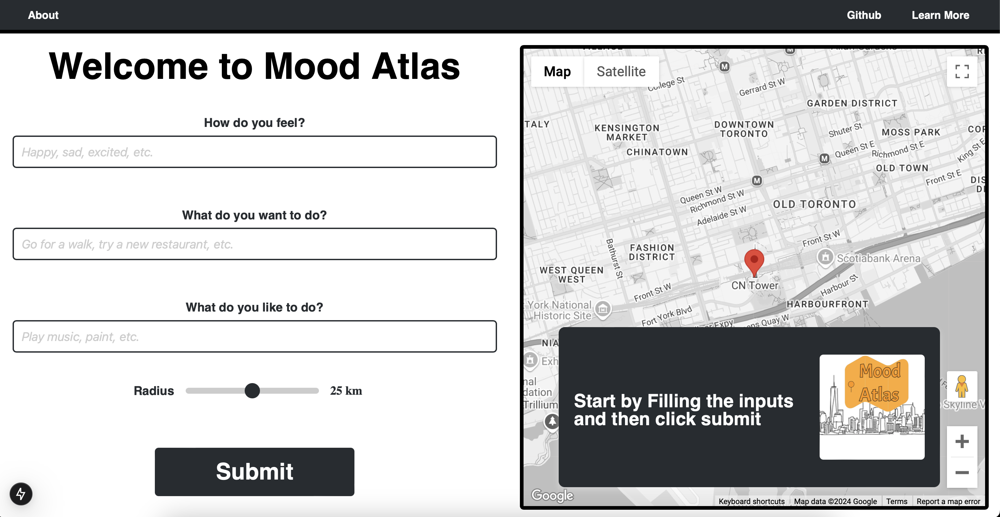

### "Chart your feelings, discover your destination."

## Project Summary: **Mood Atlas**

**Mood Atlas** is an innovative app that recommends destinations based on user moods, places, or feelings. The project integrates multiple technologies for seamless functionality. The combination of AI and real-time data creates a personalized experience, guiding users to destinations that match their feelings. This app is currently in development and is expected to be released in the near future. See the bottom of this file for the latest updates.

- **Frontend**:  
  - Developed with **React** and **Next.js**.  
  - Uses **Google Maps API** to display locations on a map.  
  - Fetches images and reviews via the **Google Places API** and displays them in user-friendly cards with hyperlinks for quick access to Google Maps.

- **Python AI Backend**:  
  - Processes user prompts and location data.  
  - Leverages **ChatGPT’s LLM** to generate personalized place recommendations.  
  - Incorporates **text embeddings** for semantic understanding of user input.  
  - Returns coordinates (from Google Places API) to pinpoint locations on the map.

- **Spring Boot Backend**:  
  - Manages user data (e.g., name, email) via **SQL** and **Postman**.  
  - Stores user favorites in a **Firebase** database, linked to their email.  

## **Technologies Used in Mood Atlas**

- **React**: A JavaScript library for building user interfaces, primarily for creating dynamic and responsive front-end web applications.
- **Next.js**: A React-based framework that enables server-side rendering, static site generation, and other advanced web development features.
- **Google Maps API**: Provides interactive maps and location data, allowing the app to display user destinations on a map.
- **Google Places API**: Fetches information about places, such as names, addresses, reviews, and images, to enhance user experience by providing more details about recommended locations.
- **ChatGPT’s LLM (Large Language Model)**: A powerful AI language model by OpenAI used to process and generate human-like responses to user input, providing personalized recommendations.
- **Text Embeddings**: Used to convert user input into numerical representations that capture semantic meaning, helping the AI backend understand and match users' moods with destinations.
- **SQL**: A standardized programming language used to manage and manipulate relational databases, employed here to store user data and interactions in the Spring Boot backend.
- **Postman**: A tool for testing and interacting with APIs, ensuring the functionality of the Spring Boot backend through the creation and execution of requests.
- **Firebase**: A platform for building mobile and web applications, used here to store user preferences and favorites in a real-time NoSQL database.
- **Spring Boot**: A Java-based framework used to build the back-end API, manage user data, and handle server-side logic in the Mood Atlas app.

## Project Structure
-**Not including the default Next.js files/ untouched files**
```
MOOD-ATLAS/
│
├── .next/               # Next.js build and runtime files (this folder is the final build)
├── app/                 # main application code with all the indivisual files
│   ├── global.css       # contains all the css styles used throughout the app
│   ├── layout.js        # defines the layout of the app i.e the header main page etc
│   ├── llmprocessing.js # contains the logic for processing user input and generating recommendations based on it using ChatGPT’s LLM
│   ├── location_card.js # contains the logic for displaying location cards with images etc on the map
│   ├── map.js           # contains the main google map component
│   ├── page.js          # the main page of the app with all the formating and order of components i.e where the map, location etc are and there logic
│   └── placesfetch      # contains the logic for fetching places from google places api to give to the llm for processing
├── assets/              # contains all the static assets like images etc
├── place-finder-backend/ # contains the python backend code for processing user input and generating recommendations
├── spring-backend/      # contains the spring boot backend code for the user data
├── utils/               # contains utility functions used throughout the app like global colors etc
└── next.config.mjs       # contains the configuration for the next.js app like trusted domains etc
└── tailwind.config.mjs   # contains the configuration for tailwind css
```

## How the Website Works
- the user inputs the required stuff and then clicks submit, initally there location is shown on the map
- this submitted data is propigated to the llmprocessing here we first fetch the nearby places by using google maps api and then we use this location data along with the user inputs to proccess the data and generate recommendations
- these recommendations contain data from the json file that the places fetch gave us this data is parsed and sent back to the main page
- once all this is done we display the location on the location card which sits ontop of the map which now displays the recommended place

**Ex Data, the places nearby search returns us a json file that looks something like this, this data is needed for the website to work**
```json
{
    {
    "place_id" : "ChIJRQoITNc0K4gRMBoATwPJLYs",
          "plus_code" : 
    },
    "vicinity" : "255 Wellington Street West, Toronto",
    "location" : 
    {
      "lat" : 43.64192569999999,
      "lng" : -79.3894923
    },
    "photos" : 
    [
      {
        "photo_reference" : "AWYs27znPtKuOjv43tZBTCFngJGTvlpvSD74iz3mXFo7trkgn8-jNhGtxP0zT8OdBpgRDLX4vih2Jvs-8PcJh_KVRfKablKQgHorz3rTNh0cqulc5R5OHjdI7JM2EwzxoCm_LSn2uKNu3Fw6MuYoFgSb-GrVlDZ2uudhal7pbx1KO3m7chFA",
      }
    ],
    {"etc etc "}
}
```

## End Goal
Create And Deploy This Project As A Web App, Giving user free accsess to the website along with unlimited api calls for there results (or until i run out of money)

### CURRENTLY UNDER DEVELOPMENT (there will be slight changes in the future)

**Current Version**
- Home page when first loading in:


**TODO**: 
- propigate the radius var set by user to the llm procces file and from there to the places fetch to be set as a setting in the fetch
- add a final log at the button where everything is displayed the 3 inputs + radius + procceced data + location + any other 
- fix the json format to recive proper stuff (title, address, location pic is ok, get anything else too)
- featch user location (in page once initial, update everytime by bringing the variable from llm procces file) get new location from json 

once done:
- set up python backend (django ?)
