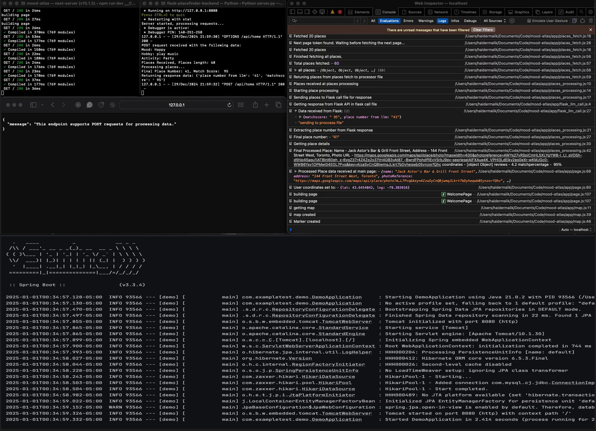

### "Chart your feelings, discover your destination."

## Project Summary: **Mood Atlas**

**Mood Atlas** is an innovative app that recommends destinations based on user moods, places, or feelings. The project integrates multiple technologies for seamless functionality. The combination of AI and real-time data creates a personalized experience, guiding users to destinations that match their feelings. This app is currently in development and is expected to be released in the near future. **See the bottom of this file for the latest updates**.

- **Frontend**:  
  - Developed with **React** and **Next.js**.  
  - Uses **Google Maps API** to display locations on a map.  
  - Fetches images and reviews via the **Google Places API** and displays them in user-friendly cards with info on the place.

- **Python AI Backend**:  
  - Processes user prompts and location data.  
  - Uses **Flask** for API endpoints. So that the nextjs and python backend can communicate with each other.
  - Leverages **ChatGPT’s LLM** to generate personalized place recommendations.    

- **Spring Boot Backend**:  
  - Manages user data (e.g., name, email) via **SQL** and **Postman**.  
  - Stores user favorites in a **Firebase** database, linked to their email.  

## **Technologies Used in Mood Atlas**

- **React**: A JavaScript library for building user interfaces, primarily for creating dynamic and responsive front-end web applications.
- **Next.js**: A React-based framework that enables server-side rendering, static site generation, and other advanced web development features.
- **Google Maps API**: Provides interactive maps and location data, allowing the app to display user destinations on a map.
- **Google Places API**: Fetches information about places, such as names, addresses, reviews, and images, to enhance user experience by providing more details about recommended locations.
- **Other API's**: Uses ipapi to get the users initial location, uses heroku to allow user to get places near them eithout using a external api file or dealing with CORS issues.
- **Flask**: A python web framework that allows for the creation of backend APIs, used for processing user prompts and location data.
- **ChatGPT’s LLM (Large Language Model)**: A powerful AI language model by OpenAI used to process and generate human-like responses to user input, providing personalized recommendations.
- **SQL**: A standardized programming language used to manage and manipulate relational databases, employed here to store user data and interactions in the Spring Boot backend.
- **Postman**: A tool for testing and interacting with APIs, ensuring the functionality of the Spring Boot backend through the creation and execution of requests.
- **Firebase**: A platform for building mobile and web applications, used here to store user preferences and favorites in a real-time NoSQL database.
- **Spring Boot**: A Java-based framework used to build the back-end API, manage user data, and handle server-side logic in the Mood Atlas app.

## Project Structure
-**Not including the default Next.js files/ untouched files**
```
MOOD-ATLAS/
│
├── .next/                        # Next.js build and runtime files (this folder is the final build)
├── app/                          # main application code with all the indivisual files
│   ├── global.css                # contains all the css styles used throughout the app
│   ├── flask_llm_call.js         # this is where the flask backend is called and also where the data sent back is recived from flask, this is called and returns its result tot processor 
│   ├── layout.js                 # defines the layout of the app i.e the header main page etc
│   ├── location_card.js          # contains the logic for displaying location cards with images etc on the map
│   ├── map.js                    # contains the main google map component 
│   ├── page.js                   # the main page of the app with all the formating and order of components i.e where the map, location etc are and there logic along with the user inputs 
│   ├── places_fetch              # contains the logic for fetching places from google places api to give to the processor for it to forward it to flask
│   ├── places_processing.js      # this is where all the inputs are recived and where we get the places send it to flask get its response and resturn the result to the page
│   └── user_location.js          # This is where we get the user's initilal location from ipapi api.
├── assets/                       # contains all the static assets like images etc
├── flask-placefinder-backend/    # contains the python backend code for processing user input and generating recommendations
│   ├── jupyter_tests/            # contains the jupyter notebooks for testing the python backend along with some test data
│   └── server.py                 # the main flask server file where we get the data from the app files and then the llm is prompted to return a result back to the user
├── spring-backend/               # contains the spring boot backend code for the user data
├── utils/                        # contains utility functions used throughout the app like global colors etc
├── next.config.mjs               # contains the configuration for the next.js app like trusted domains etc
└── tailwind.config.mjs           # contains the configuration for tailwind css
```

## How the Website Works
- the user inputs the required stuff and then clicks submit, initally there location is shown on the map.
- this submitted data is propigated to the llmprocessing here we first fetch the nearby places by using google maps api and then we use this location data along with the user inputs to proccess the data and generate recommendations.
- these recommendations contain info about the object that when returned to the frontend can be parsed and extracted for things like location, address etc.
- once all this is done we display the location on the location card which sits ontop of the map which now displays the recommended place along with additional info.

**Ex Data, the places nearby search returns us a json file that looks something like this, this data is needed for the website to work**
```json
{
    {
    "place_id" : "ChIJRQoITNc0K4gRMBoATwPJLYs",
          "plus_code" : 
    },
    "vicinity" : "255 Wellington Street West, Toronto",
    "location" : 
    {
      "lat" : 43.64192569999999,
      "lng" : -79.3894923
    },
    "photos" : 
    [
      {
        "photo_reference" : "AWYs27znPtKuOjv43tZBTCFngJGTvlpvSD74iz3mXFo7trkgn8-jNhGtxP0zT8OdBpgRDLX4vih2Jvs-8PcJh_KVRfKablKQgHorz3rTNh0cqulc5R5OHjdI7JM2EwzxoCm_LSn2uKNu3Fw6MuYoFgSb-GrVlDZ2uudhal7pbx1KO3m7chFA",
      }
    ],
    {"etc etc this is not the exact format of the json file but it is something like this"}
}
```

**EX LLM promt, here is an example of what the prompt might look like to ask the llm to pick a place**
```python
llm = chatopenai(model, key, etc)
my_promt = " FOLLOW THESE INSTRUCTION WITH DATA {places},{mood},{etc}  " # fill in with actual data from fontend
response = llm.promt(my_promt)
place_key = reponse[0]
# ETC ETC 
```

## End Goal
Create And Deploy This Project As A Web App, Giving user free accsess to the website along with unlimited api calls for there results (or until i run out of money)

### CURRENTLY UNDER DEVELOPMENT (there will be slight changes in the future)

**Current Version**
- Home page when first loading in:

- After submitting the form:

- Backend Servers (running locally)


**TODO**: 

- add algo so res for mood atlas math determine user location factor

- make location radial ofset engine better

- add spring boot and DB

- Fix cors issue for google places api
- Fix CSS